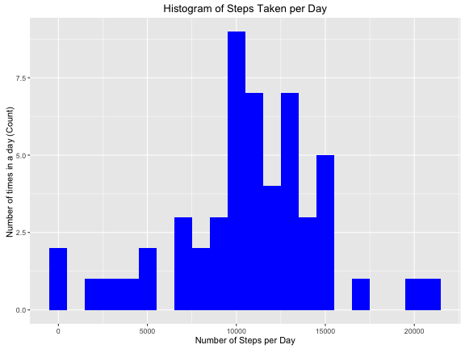
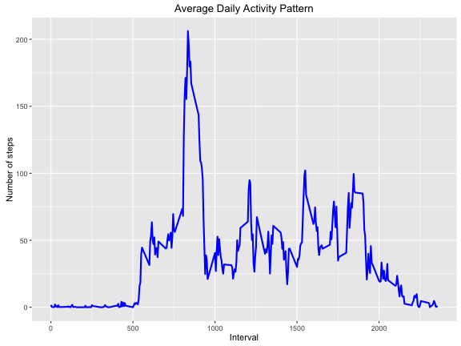
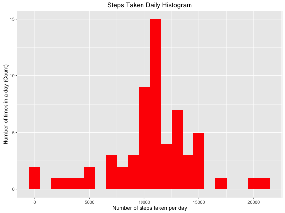
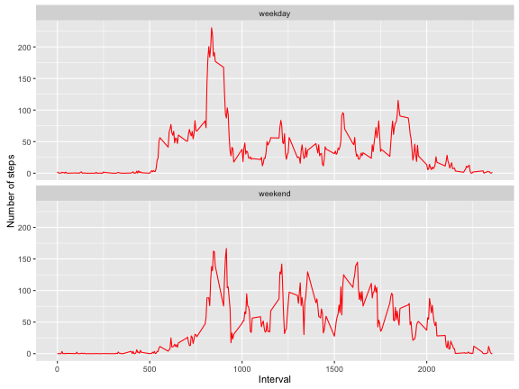

## Initialization  
Loading needed data packages 

```r
library(knitr)
library(ggplot2)
library(data.table)
knitr::opts_chunk$set(echo = TRUE, results = 'show')
```


## Reading and Loading necessary data files  
Note: make sure that the data file is in your working directory.   
  
Unzipping and reading the data file into R:

```r
if(!file.exists("activity.csv")){
  unzip("activity.zip")
}

## Reading the data into a data frame called activityData
activityData <- read.csv("activity.csv", header = TRUE, sep = ",", colClasses = c("numeric", "character","numeric"))
```
  
Now that the data is in our data frame, we can tidy up the data before doing any data analysis.  


```r
activityData$date <- as.Date(activityData$date, format = "%Y-%m-%d")
activityData$interval <- as.factor(activityData$interval)

## Checking the structure of our data frame
str(activityData)
```

```
## 'data.frame':	17568 obs. of  3 variables:
##  $ steps   : num  NA NA NA NA NA NA NA NA NA NA ...
##  $ date    : Date, format: "2012-10-01" "2012-10-01" ...
##  $ interval: Factor w/ 288 levels "0","5","10","15",..: 1 2 3 4 5 6 7 8 9 10 ...
```

## Mean total number of steps taken per day  
To calculate the mean total number of steps taken per day, we first calculate the total number of steps taken per day.


```r
steps_taken_daily <- aggregate(steps~date, activityData, sum)
colnames(steps_taken_daily) <- c("date", "steps")
head(steps_taken_daily)
```

```
##         date steps
## 1 2012-10-02   126
## 2 2012-10-03 11352
## 3 2012-10-04 12116
## 4 2012-10-05 13294
## 5 2012-10-06 15420
## 6 2012-10-07 11015
```
  
Now that we have the total number of steps taken per day, the next step is to plot a histogram of the total number of steps taken per day.  


```r
  ggplot (steps_taken_daily, aes(x=steps)) + geom_histogram(fill = "blue", binwidth = 1000) +
                labs(title = "Histogram of Steps Taken per Day", 
                     x = "Number of Steps per Day", y = "Number of times in a day (Count) ")
```



The final step is to calculate the mean and median of the total number of steps taken per day.  


```r
steps_mean <- mean(steps_taken_daily$steps, na.rm = TRUE) ## ignoring missing values
steps_median <- median(steps_taken_daily$steps, na.rm = TRUE)   ## ignoring missing values  
steps_mean  
```

```
## [1] 10766.19
```

```r
steps_median  
```

```
## [1] 10765
```

Hence we can see that the mean number of steps taken per day is 1.0766189 &times; 10<sup>4</sup> and the median number of steps taken per day is 1.0765 &times; 10<sup>4</sup>.  

## Average Daily Activity Pattern  
  
Before plotting the average daily activity pattern, we will first calculate the steps taken per interval, and aggregate that data:  


```r
 steps_taken_interval <- aggregate (activityData$steps, by = list(interval = activityData$interval),
                                FUN = mean, na.rm = TRUE)
steps_taken_interval$interval <-  as.integer(levels(steps_taken_interval$interval)[steps_taken_interval$interval])
colnames(steps_taken_interval) <-  c("interval", "steps")
```
  
Now that this is done, we can plot a line graph:  

```r
ggplot(steps_taken_interval, aes(x=interval, y = steps)) + geom_line(color ="blue", size = 1) +
       labs(title = "Average Daily Activity Pattern", x = "Interval", y = "Number of steps")
```


  
To calculate which 5-minute interval contains the maximum number of steps across all the days in the dataset, we run the following code chunk:  

```r
  max_number_steps_interval <- steps_taken_interval[which.max(steps_taken_interval$steps),]
  max_number_steps_interval
```

```
##     interval    steps
## 104      835 206.1698
```
  
We can see that the interval with the max number of steps is 835.  

## Imputing missing values  

In order to impute missing values, we first need to figure out how many missing values are present in the data set.


```r
 number_missing_values <- sum(is.na(activityData$steps))
 number_missing_values
```

```
## [1] 2304
```
  
We can see that the number of missing values in the data set is 2304. Now that we have this value, we can come up with a strategy to fill up these slots. In this case, the mean for that particular interval will be used to impute the missing values. A new function na_impute was used to do this:  


```r
na_impute <- function(data,perValue) {
    na_index <- which(is.na(data$steps))
    na_replace <- unlist(lapply(na_index, FUN = function(idx){
                 interval = data[idx,]$interval
                 perValue[perValue$interval == interval,]$steps
    }))
    fill_steps <- data$steps
    fill_steps[na_index] <- na_replace
    fill_steps
}
```

Using this function, a new data frame, activityData_fill was created, with no missing values:  

```r
  activityData_fill <- data.frame(
  steps = na_impute(activityData,steps_taken_interval),
  date  = activityData$date,
  interval = activityData$interval)
str(activityData_fill)
```

```
## 'data.frame':	17568 obs. of  3 variables:
##  $ steps   : num  1.717 0.3396 0.1321 0.1509 0.0755 ...
##  $ date    : Date, format: "2012-10-01" "2012-10-01" ...
##  $ interval: Factor w/ 288 levels "0","5","10","15",..: 1 2 3 4 5 6 7 8 9 10 ...
```

Now, we check to see if there are any missing values after calling na_impute:  

```r
   sum(is.na(activityData_fill$steps))
```

```
## [1] 0
```
We can see that there are no more missing values, after running the na_impute function.  

Now a histogram is plotted with the new data:  

```r
daily_fill_steps <- aggregate(steps~date, activityData_fill, sum)
colnames(daily_fill_steps) <- c("date","steps")
ggplot(daily_fill_steps, aes(x = steps)) + geom_histogram(fill = "red", binwidth = 1000)+ labs(title = "Steps Taken Daily Histogram", x = "Number of steps taken per day", y = "Number of times in a day (Count)")
```



Furthermore, the new mean and median for total number of steps taken per day is calculated:  

```r
steps_mean_fill <- mean(daily_fill_steps$steps, na.rm = TRUE)
steps_median_fill <- median(daily_fill_steps$steps, na.rm = TRUE)
```

The new mean after imputing missing values is 1.0766189 &times; 10<sup>4</sup>, while the new median after imputing missing values is 1.0766189 &times; 10<sup>4</sup>.  


```r
steps_mean  ## mean before impute
```

```
## [1] 10766.19
```

```r
steps_median  ## median before impute
```

```
## [1] 10765
```

```r
steps_mean_fill ## mean after impute
```

```
## [1] 10766.19
```

```r
steps_median_fill ## median after impute
```

```
## [1] 10766.19
```

After the impute, we see that the mean and the median are the same; this is due to the fact that we used the mean value to impute the missing values.  

## Differences in activity patterns between weekdays and weekends  

For this analysis, the filled in data set, activityData_fill was used.  

First, a new factor variable with two levels, "weekday" and "weekend" were created, in order to show whether a given day is a weekday or a weekend day:  

```r
## First function aggregates the data, and averages 
steps_weekdays <- function(data){
    steps_weekdays <-  aggregate(data$steps, by = list(interval = data$interval), 
                                 FUN = mean, na.rm = T)
    steps_weekdays$interval <- as.integer(levels(steps_weekdays$interval)[steps_weekdays$interval])
    colnames(steps_weekdays) <- c("interval", "steps")
    steps_weekdays
}
```


```r
## Second function factorizes the data set into the two variables "weekend" and "weekday"
weekdays_data <- function(data){
  data$weekday <- as.factor(weekdays(data$date)) ## using weekdays function 
  data_weekend <- subset(data,weekday %in% c("Saturday", "Sunday"))
  data_weekday <- subset(data,!weekday %in% c("Saturday", "Sunday"))
  
  steps_weekend <- steps_weekdays(data_weekend)
  steps_weekday <- steps_weekdays(data_weekday)
  
  steps_weekend$dayofweek <- rep("weekend", nrow(steps_weekend))
  steps_weekday$dayofweek <- rep("weekday", nrow(steps_weekday))
  
  weekdays_data <- rbind(steps_weekend, steps_weekday)
  weekdays_data$dayofweek <- as.factor(weekdays_data$dayofweek)
  weekdays_data
}

weekdaysData <-  weekdays_data(activityData_fill)
```

Now that this has been done, a panel plot containing a time series plot, of the 5 minute interval (x axis) and the average number of steps taken, averaged across all weekdays or weekends (y axis):  


```r
 ggplot(weekdaysData, aes(x= interval, y = steps)) +
       geom_line(color = "red") +
       facet_wrap(~dayofweek,nrow = 2, ncol = 1)+
       labs(x = "Interval", y = "Number of steps")
```


